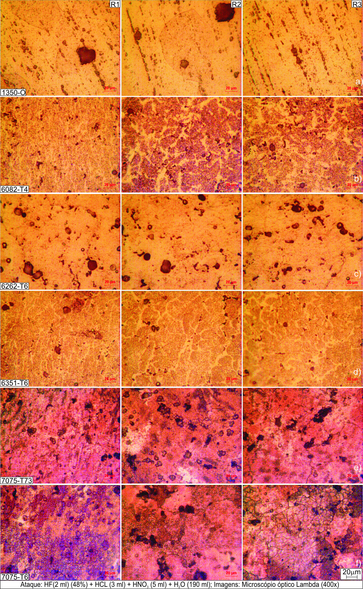

# Metalurgia aplicada das ligas de alumínio {#sec-cap2}

## Introdução {#sec-cap2-intro}

Duas barras de alumínio, do mesmo diâmetro, mesma cor, mesmo peso aparente, chegam ao torno. Uma se deixa cortar com folga, produz cavaco curto que salta para longe da peça e devolve uma superfície espelhada. A outra gruda na ferramenta, forma um cavaco longo e emaranhado que arranha o acabamento, e obriga a reduzir o avanço. Para o operador, são "as duas de alumínio". Para o metalurgista, são materiais tão diferentes quanto um pinho e um jatobá — e a diferença já estava decidida antes de a peça encostar na ferramenta, na composição química e no tratamento térmico de cada uma.

Este capítulo trata dessa diferença. Ele não é um tratado de metalurgia física; é o mínimo de metalurgia que um engenheiro de manufatura precisa dominar para **prever** como uma liga de alumínio vai se comportar na usinagem, em vez de descobrir na tentativa e erro. A tese de que este livro nasceu comparou seis ligas de alumínio no torneamento, e a primeira lição do estudo foi justamente esta: o desempenho de usinagem — força, potência, temperatura, cavaco, acabamento — só faz sentido quando se conhece a microestrutura por trás dele.

Por isso o capítulo usa como fio condutor as **seis ligas do estudo de caso** que reaparecerão na Parte III do livro:

- **1350-O** — alumínio quase puro, recozido: a mais dúctil e a menos resistente;
- **6082-T4, 6262-T6, 6351-T6** — a família Al-Mg-Si, o "cavalo de trabalho" da usinagem;
- **7075-T73 e 7075-T6** — a família Al-Zn-Mg, o "ultraduroalumínio", a mais resistente.

Da 1350-O à 7075-T6, o limite de resistência salta de cerca de 60 MPa para mais de 540 MPa — quase dez vezes. Nenhuma delas mudou de elemento principal por acaso, e nenhuma chegou a essa resistência sem um mecanismo metalúrgico específico. Entender esses mecanismos é entender por que a 7075-T6 exige o dobro de força de corte da 1350-O, e por que a 6262-T6 — nem a mais dura nem a mais mole — é frequentemente a mais fácil de usinar de todas.

::: {.callout-note}
## Onde este capítulo se conecta
A metalurgia apresentada aqui é a base física dos resultados experimentais dos capítulos @sec-cap8 a @sec-cap10. Quando, na Parte III, uma liga exigir mais potência ou gerar pior acabamento, a explicação estará na microestrutura descrita neste capítulo.
:::

## Classificação e nomenclatura {#sec-cap2-classificacao}

Antes de discutir propriedades, é preciso um vocabulário comum. Uma liga de alumínio é identificada por dois códigos independentes: um para a **composição** (a série numérica) e outro para o **estado metalúrgico** (a têmpera). Confundir os dois é a origem de boa parte dos erros de especificação no chão de fábrica.

### O sistema numérico de quatro dígitos

As ligas de alumínio trabalhadas (por conformação — extrudadas, laminadas, forjadas) seguem o sistema numérico de quatro dígitos `xxxx`. O primeiro dígito indica a série e o principal elemento de liga; o segundo indica modificações da liga original ou limites de impureza; e os dois últimos identificam a liga específica ou, na série 1xxx, a pureza do alumínio [@callister2007material; @hatch1984aluminum]. Uma letra como prefixo indica liga experimental; como sufixo, variações nacionais.

A Tabela @tbl-series resume as oito séries em uso e seus elementos principais.

| Série | Elemento principal | Endurecível por | Característica dominante |
|:-----:|:-------------------|:----------------|:-------------------------|
| 1xxx  | Al puro (> 99%)    | Encruamento     | Condutividade, corrosão  |
| 2xxx  | Cobre (Cu)         | Precipitação    | Alta resistência (aeronáutica) |
| 3xxx  | Manganês (Mn)      | Encruamento     | Conformabilidade         |
| 4xxx  | Silício (Si)       | (varia)         | Baixo ponto de fusão     |
| 5xxx  | Magnésio (Mg)      | Encruamento     | Resistência à corrosão marinha |
| 6xxx  | Mg + Si            | Precipitação    | Equilíbrio geral, usinabilidade |
| 7xxx  | Zinco (Zn) + Mg    | Precipitação    | Máxima resistência       |
| 8xxx  | Lítio (Li), Fe     | (varia)         | Aplicações especiais     |

: Séries das ligas de alumínio trabalháveis e seus elementos principais [@askeland2005science; @budd2009resource]. {#tbl-series}

Deste quadro, três séries interessam a este livro. A **1xxx** representa o alumínio puro — a referência de ductilidade e condutividade. A **6xxx** (Al-Mg-Si) é a mais versátil e a mais usinada da indústria. A **7xxx** (Al-Zn-Mg) é a de maior resistência mecânica, o chamado *ultraduroalumínio*. As séries 2xxx e 5xxx aparecerão apenas como contraste.

::: {.callout-tip}
## Na prática
Uma regra rápida de leitura: séries **1, 3, 5** endurecem por *encruamento* (deformação a frio) e não respondem a tratamento térmico; séries **2, 6, 7** endurecem por *precipitação* (tratamento térmico). Saber a que grupo a liga pertence já antecipa se a dureza dela veio do laminador ou do forno — e isso muda o comportamento na usinagem.
:::

### A designação de têmpera

A mesma liga pode existir em estados metalúrgicos radicalmente diferentes. A têmpera — a letra (e números) após o hífen — descreve o tratamento que o material sofreu e, portanto, sua condição mecânica. As categorias básicas são [@gomes1974propried; @hatch1984aluminum]:

- **F** — como fabricada (sem controle especial);
- **O** — recozida (máxima ductilidade, mínima resistência);
- **H** — encruada (endurecida por deformação a frio);
- **W** — solubilizada (estado instável, transitório);
- **T** — tratada termicamente para condição estável.

O grupo **H** (encruamento) subdivide-se em H1 (apenas encruada), H2 (encruada e parcialmente recozida), H3 (estabilizada após encruamento) e H4 (deformada a frio e pintada/envernizada).

O grupo **T** (tratamento térmico) é o mais importante para as ligas deste livro e merece a Tabela @tbl-temperas.

| Têmpera | Significado |
|:-------:|:------------|
| T1 | Resfriada da conformação a quente + envelhecida naturalmente |
| T3 | Solubilizada + encruada + envelhecida naturalmente |
| T4 | Solubilizada + envelhecida naturalmente |
| T5 | Resfriada da conformação a quente + envelhecida artificialmente |
| **T6** | **Solubilizada + envelhecida artificialmente** |
| T7 | Solubilizada + estabilizada (superenvelhecida) |
| T8 | Solubilizada + encruada + envelhecida artificialmente |

: Principais têmperas do grupo T [@degarmo2002material]. As destacadas (T4, T6, T7) descrevem as ligas do estudo. {#tbl-temperas}

Essas três têmperas do grupo T definem as ligas 6xxx e 7xxx deste livro, e a diferença entre elas é enorme na prática. Um exemplo da própria literatura ilustra: a liga 6066 passou de 223 MPa no estado **O** (recozido) para 445 MPa em **T4** e 478 MPa em **T6** — mais do que dobrando a resistência apenas pela mudança de têmpera, sem alterar um átomo de composição [@tan2007]. A liga é a mesma; o que muda é o que o forno fez com ela.

::: {.callout-important}
## Decisão de projeto
Especificar "alumínio 7075" sem a têmpera é especificar pela metade. A 7075-T6 e a 7075-T73 têm composição idêntica, mas resistências e comportamentos de usinagem distintos — a diferença está inteiramente no tratamento térmico, como as micrografias deste capítulo mostrarão.
:::

## As séries 1xxx, 6xxx e 7xxx {#sec-cap2-series}

Com o vocabulário estabelecido, vejamos o que caracteriza cada uma das três séries de interesse — primeiro em propriedades gerais, depois em composição química.

### Propriedades gerais das ligas de alumínio

Comparadas aos aços, as ligas de alumínio têm cerca de **1/3 da densidade e do módulo de elasticidade**, elevada condutividade térmica e elétrica, alto coeficiente de atrito, excelente conformabilidade, baixo ponto de fusão, alta resistência à corrosão e neutralidade magnética [@weingaertner1991tecnolog]. Essas características, boas para o produto, criam desafios específicos na usinagem: o alto coeficiente de atrito e a tendência à adesão favorecem a formação de aresta postiça de corte; a alta condutividade térmica dissipa calor rapidamente (bom para a ferramenta, mas altera o campo térmico da medição); e a baixa dureza de algumas ligas gera cavacos longos e contínuos difíceis de controlar.

Dentro desse panorama, cada série tem um perfil [@okumura1982taniguch]:

- **1xxx** — pureza ~99%, boa resistência à corrosão, alta condutividade térmica e elétrica, boa soldabilidade, mas **baixa resistência mecânica**;
- **6xxx** — bom equilíbrio: usinabilidade, resistência à corrosão e soldabilidade satisfatórias;
- **7xxx** — **elevada resistência mecânica** (ultraduroalumínio), mas resistência à corrosão e soldabilidade limitadas.

### As fases presentes em cada série

A resistência de uma liga de alumínio vem, em grande parte, das **segundas fases** — partículas que se formam quando os elementos de liga excedem a solubilidade na matriz de alumínio. Cada série tem sua assinatura de fases [@cerri1999metallog]:

- Na **1xxx**, as impurezas de Fe e Si (baixa solubilidade no Al puro) formam fases como FeAl₃, Fe₃SiAl e Fe₂Si₂Al₉;
- Na **6xxx**, o Mg e o Si precipitam principalmente como **Mg₂Si**, seguindo a sequência de endurecimento (detalhada na próxima seção). Podem também surgir fases grosseiras insolúveis ricas em Fe (Fe₃SiAl₁₂, Fe₂Si₂Al₉);
- Na **7xxx**, o Zn e o Mg precipitam como **MgZn₂** — o principal responsável pela alta resistência dessas ligas [@hatch1984aluminum]. Elementos secundários (Cu, Cr, Zr, Mn) geram fases adicionais como Al₇Cu₂Fe e Al₃Zr.

Guardar os nomes Mg₂Si (para 6xxx) e MgZn₂ (para 7xxx) é guardar a chave de por que essas duas famílias endurecem — e por que respondem tão bem ao tratamento térmico.

### Composição química das seis ligas do estudo

As seis ligas deste livro foram barras redondas extrudadas (Ø 101 mm × 2000 mm), fabricadas pela Alcoa e escolhidas justamente para cobrir um amplo espectro de propriedades — da mais dúctil e menos resistente (1350-O) à menos dúctil e mais resistente (7075-T6). A Tabela @tbl-composicao apresenta os principais elementos de cada uma.

| Elemento | 1350-O | 6082-T4 | 6262-T6 | 6351-T6 | 7075-T73 | 7075-T6 |
|:--------:|:------:|:-------:|:-------:|:-------:|:--------:|:-------:|
| Cu | 0,05 | 0,10 | 0,15–0,40 | 0,10 | 1,2–2,0 | 1,2–2,0 |
| Fe | 0,40 | 0,50 | 0,70 | 0,50 | 0,50 | 0,05 |
| **Mg** | 0,03 | 0,60–1,20 | 0,80–1,20 | 0,40–0,80 | 2,1–2,9 | 2,1–2,9 |
| Mn | 0,10 | 0,40–1,0 | 0,15 | 0,4–0,80 | 0,30 | 0,30 |
| **Si** | 0,10 | 0,70–1,30 | 0,40–0,80 | 0,70–1,30 | 0,40 | 0,40 |
| **Zn** | 0,05 | 0,20 | 0,25 | 0,20 | 5,1–6,1 | 5,1–6,1 |
| **Bi** | 0,03 | 0,05 | 0,40–0,70 | 0,05 | 0,05 | 0,05 |
| **Pb** | 0,03 | 0,05 | 0,40–0,70 | 0,05 | 0,05 | 0,05 |
| Cr | 0,01 | 0,25 | 0,04–0,14 | 0,05 | 0,18–0,28 | 0,18–0,28 |

: Composição química (% em peso) das seis ligas do estudo [@alcoa2009certific]. Em destaque, os elementos que definem o comportamento de cada família. {#tbl-composicao}

A tabela conta uma história se lida por colunas. A **1350-O** quase não tem elementos de liga — é alumínio com Fe e Si como impurezas. As três **6xxx** têm Mg e Si como protagonistas, mas note a **6262-T6**: ela carrega Bi e Pb (0,40–0,70%) que nenhuma outra tem — são os elementos de livre-corte, e voltaremos a eles. As duas **7075** são quimicamente idênticas entre si (Zn 5,1–6,1% + Mg 2,1–2,9%); o que as separará é só a têmpera.

## Mecanismos de endurecimento {#sec-cap2-endurecimento}

Aqui está o coração metalúrgico do capítulo. Uma liga de alumínio pode ganhar resistência por dois caminhos fundamentalmente diferentes, e a distinção entre eles explica quase tudo o que acontece depois na usinagem.

### O princípio comum: barrar as discordâncias

Deformar plasticamente um metal é, em nível atômico, mover **discordâncias** — defeitos lineares na rede cristalina que deslizam sob tensão. Quanto mais fácil o movimento das discordâncias, mais mole e dúctil o material. Endurecer uma liga significa, sempre, **criar obstáculos a esse movimento**. Os dois mecanismos abaixo fazem isso de formas distintas [@johansen1994structur].

### Endurecimento por precipitação (ligas tratáveis termicamente)

Este é o mecanismo das séries 2xxx, 6xxx e 7xxx — e das cinco ligas tratáveis do estudo (todas menos a 1350-O). O ganho de resistência vem da **distribuição de finas partículas de precipitados** na estrutura cristalina dos grãos. Essas partículas, coerentes ou parcialmente coerentes com a matriz de alumínio, interferem no movimento das discordâncias — e, ao fazê-lo, reduzem a ductilidade na mesma medida em que aumentam a resistência [@johansen1994structur].

O processo tem três etapas, com temperaturas bem definidas [@marshallndstages; @demir2009]:

1. **Solubilização** (460–550 °C): a liga é aquecida até que os elementos de liga (Mg, Si, Zn, Cu) se dissolvam na matriz, formando uma solução sólida homogênea;
2. **Têmpera / resfriamento rápido** (abaixo de ~290 °C): o resfriamento brusco "congela" os átomos em solução, gerando uma **solução sólida supersaturada** (SSS) — instável, com mais soluto do que caberia em equilíbrio;
3. **Envelhecimento**: mantida à temperatura ambiente por longos períodos (**envelhecimento natural**) ou entre 160–200 °C por horas (**envelhecimento artificial**), a SSS libera o excesso de soluto na forma de finos precipitados.

Para a série 6xxx, a sequência de precipitação do Mg₂Si é [@cerri1999metallog; @tan2007]:

$$\text{SSS} \;\rightarrow\; \text{zonas G.P.} \;\rightarrow\; \beta''(\text{Mg}_2\text{Si}) \;\rightarrow\; \beta'(\text{Mg}_2\text{Si}) \;\rightarrow\; \beta\,(\text{Mg}_2\text{Si})$$

As zonas de Guinier-Preston (G.P.) e os precipitados intermediários β'' e β' são os que mais endurecem, por serem finos e coerentes; o β de equilíbrio, grosseiro, endurece menos. É por isso que **existe um pico de dureza**: envelhecer de menos não forma precipitados suficientes; envelhecer demais faz os precipitados coalescerem (crescerem e perderem coerência), e a dureza cai — fenômeno chamado *superenvelhecimento*.

A literatura mostra esse pico com clareza. Para a liga 6061, os melhores resultados de dureza vieram de solubilização a 530 °C seguida de envelhecimento a 180 °C por 3 a 5 horas; tempos menores (1 h) não formavam precipitados suficientes, e tempos muito longos (24 h) provocavam coalescimento e queda de dureza [@demir2009]. A fração volumétrica da fase Mg₂Si — e, portanto, a resistência — depende diretamente da quantidade de Mg e Si disponível na liga [@tan2007].

::: {.callout-tip}
## Na prática
O pico de envelhecimento é uma faca de dois gumes na usinagem. A têmpera T6 (envelhecida ao pico) dá a máxima dureza e resistência — ótimo para o produto, mas exige mais força e potência de corte. A têmpera T73 (superenvelhecida) sacrifica um pouco de resistência em troca de melhor resistência à corrosão sob tensão. As micrografias adiante mostram essa diferença na 7075.
:::

### Endurecimento por encruamento (ligas não tratáveis)

As séries 1xxx, 3xxx, 4xxx e 5xxx não formam precipitados endurecedores — não respondem a tratamento térmico. Elas ganham resistência por **encruamento** (deformação a frio). Nesse caso, o obstáculo às discordâncias são as **próprias discordâncias**: à medida que o metal é conformado a frio, a densidade de discordâncias cresce, e elas passam a impedir o deslizamento umas das outras [@marshallndsolute].

A única liga não tratável do estudo é a **1350-O** — e o sufixo **O** indica que ela está *recozida*, ou seja, no estado de mínima densidade de discordâncias e máxima ductilidade. É, deliberadamente, a liga mais mole do conjunto: sem precipitados endurecedores e sem encruamento, ela representa o piso de resistência.

::: {.callout-warning}
## Erro comum
Tentar endurecer uma liga 6xxx ou 7xxx "batendo" ou deformando a frio (encruamento) desperdiça o mecanismo principal delas, que é a precipitação. E tentar tratar termicamente uma liga 1xxx ou 5xxx para endurecê-la simplesmente não funciona — elas não têm os elementos que formam precipitados. Cada família tem seu mecanismo; usar o errado não dá resultado.
:::

### O papel dos elementos de liga

Os precipitados que endurecem vêm dos elementos de liga, mas cada elemento tem um papel específico [@warmuzek2004metallog; @anonndmetals]:

- **Mg + Si** (série 6xxx): formam o Mg₂Si, precipitado endurecedor central; o Si em excesso melhora fluidez e resistência ao desgaste, mas acima de ~12% forma ligas abrasivas que desgastam a ferramenta;
- **Zn + Mg** (série 7xxx): formam o MgZn₂; o Zn isolado (3–7,5% combinado ao Mg) dá a máxima resposta ao tratamento térmico — daí a supremacia de resistência da 7xxx;
- **Cu** (2–10%): melhora solubilização/envelhecimento, aumenta resistência e dureza, mas reduz alongamento;
- **Mn**: aumenta a resistência (em solução sólida e como fase dispersa) e atua como **refinador de grão**, sem sacrificar ductilidade;
- **Fe**: impureza mais comum (~0,04% de solubilidade); acima disso forma fases intermetálicas AlFeSi;
- **Bi e Pb** — os **elementos de livre-corte**: não formam precipitados endurecedores, mas, por terem baixo ponto de fusão e baixa solubilidade no Al, formam glóbulos de fase macia que fundem na temperatura de corte, fragmentam o cavaco e lubrificam a ferramenta. A **6262-T6** é a liga do estudo que contém esses elementos — e é essa a razão de sua excelente usinabilidade, apesar de não ser a mais dura.

## Tratamentos térmicos e mecânicos {#sec-cap2-tratamentos}

Vistos os mecanismos, esta seção detalha os tratamentos que os acionam — e como cada uma das seis ligas foi tratada.

### Solubilização, têmpera e envelhecimento

Como visto, o trio solubilização → têmpera → envelhecimento é o ciclo de endurecimento por precipitação. O que a Tabela @tbl-tratamentos torna concreto é que **a mesma sequência, com temperaturas e tempos diferentes, produz microestruturas diferentes** — e é isso que separa as ligas 6xxx entre si e as duas 7075 uma da outra.

| Liga | Tratamento realizado |
|:----:|:---------------------|
| 1350-O | Recozida (~345 °C, 3–4 h) — sem endurecimento |
| 6082-T4 | Solubilizada 520–540 °C + resfriada + **envelhecida naturalmente** |
| 6262-T6 | Solubilizada 520–540 °C + **envelhecida artificialmente** 170–180 °C, 6–8 h |
| 6351-T6 | Solubilizada 520–540 °C + **envelhecida artificialmente** 170–180 °C, 6–8 h |
| 7075-T73 | Solubilizada 465 °C + **superenvelhecida** (105 °C 6–8 h → 170 °C 14–18 h) |
| 7075-T6 | Solubilizada 465 °C + **envelhecida artificialmente** 120 °C, 24 h |

: Tratamentos térmicos das seis ligas do estudo. {#tbl-tratamentos}

Duas comparações valem destaque. Primeira: **6082-T4 vs 6351-T6** — mesma família Al-Mg-Si, mas a T4 (envelhecida naturalmente, à temperatura ambiente) forma precipitados menos desenvolvidos que a T6 (envelhecida artificialmente, no forno). A T6 é mais dura. Segunda: **7075-T6 vs 7075-T73** — composição idêntica, mas a T6 é envelhecida ao pico (máxima dureza) enquanto a T73 é superenvelhecida (precipitados coalescidos, um pouco menos dura, mais resistente à corrosão). As micrografias da próxima seção tornam essa diferença visível.

### Outros tratamentos

Além do ciclo de precipitação, duas operações complementares aparecem nas ligas de alumínio [@coutinho1980metalogr]:

- **Homogeneização** (~500 °C): elimina segregações e gera estrutura estável, geralmente antes da conformação;
- **Recozimento** (200–350 °C): recristaliza a liga, removendo os efeitos do trabalho a frio e devolvendo a máxima ductilidade — é o tratamento que define o estado **O** da 1350-O.

Vale notar que ligas tratáveis também podem ser encruadas: a 6066 solubilizada e envelhecida ganhou +110% no limite de resistência quando submetida a 10–40% de deformação adicional [@tan2007]. Os dois mecanismos podem, portanto, somar-se — o que dá origem às têmperas combinadas (T3, T8, T9).

## Propriedades mecânicas relevantes para a usinagem {#sec-cap2-propriedades}

Toda a metalurgia anterior converge aqui: nas propriedades que o engenheiro de manufatura efetivamente sente na ferramenta. E é aqui que a microestrutura deixa de ser abstração e vira imagem.

### O espectro de propriedades das seis ligas

A Tabela @tbl-propriedades ordena as seis ligas por resistência, da mais mole à mais dura.

| Liga | R (MPa) | e₀,₂% (MPa) | Alongamento (%) | Posição |
|:----:|:-------:|:-----------:|:---------------:|:--------|
| 1350-O | 60–95 | 20–60 | > 25 | Piso: dúctil, mole |
| 6082-T4 | > 190 | > 120 | > 14 | 6xxx envelhecida natural |
| 6262-T6 | > 260 | > 240 | > 10 | 6xxx + livre-corte |
| 6351-T6 | > 290 | > 255 | > 8 | 6xxx mais resistente |
| 7075-T73 | > 470 | > 395 | > 7 | 7xxx superenvelhecida |
| 7075-T6 | > 540 | > 485 | > 7 | Topo: resistente, menos dúctil |

: Propriedades mecânicas das seis ligas [@alcoa2009certific]. R = limite de resistência; e₀,₂% = limite de escoamento; alongamento = medida de ductilidade. {#tbl-propriedades}

O padrão é inversamente proporcional e não é coincidência: **conforme a resistência sobe, o alongamento (ductilidade) cai**. A 1350-O alonga mais de 25% mas resiste a menos de 95 MPa; a 7075-T6 resiste a mais de 540 MPa mas alonga apenas 7%. Essa relação inversa é consequência direta dos mecanismos de endurecimento — todo obstáculo que barra discordâncias para aumentar a resistência também impede a deformação plástica que constitui a ductilidade.

Para a usinagem, essa tabela é preditiva. Ligas de baixa resistência e alta ductilidade (1350-O) tendem a formar cavacos longos e contínuos e a aderir à ferramenta (aresta postiça), com risco de mau acabamento. Ligas de alta resistência (7075-T6) exigem maiores forças e potências de corte. E a liga de melhor usinabilidade não é necessariamente a mais mole nem a mais dura — é a que forma cavaco fragmentado e lubrifica o corte, papel que, no estudo, cabe à 6262-T6 e seus elementos de livre-corte.

### A microestrutura das seis ligas

A Figura @fig-micro-ligas é a imagem-síntese deste capítulo: as microestruturas das seis ligas, reveladas por ataque com reagente de Keller (2 mL HF + 3 mL HCl + 5 mL HNO₃ + 190 mL H₂O) e observadas em microscópio óptico a 400×. Ler essas seis imagens é ler, ao microscópio, tudo o que as seções anteriores anteciparam.

{#fig-micro-ligas width=95%}

Percorrendo as seis, liga a liga:

**(a) 1350-O** — alumínio quase puro, recozido. Aparecem dispersóides e precipitados coagulados de compostos intermetálicos (FeAl₃, AlFeSi) na matriz, mas em concentração baixa demais para barrar efetivamente as discordâncias. Resultado: baixa resistência, alta ductilidade — o piso do espectro [@hatch1984aluminum; @coutinho1980metalogr].

**(b) 6082-T4** — Al-Mg-Si envelhecida naturalmente. Uma densa matriz de finos precipitados de **Mg₂Si** (pontos escuros circulares) dentro dos grãos. Essa densidade cria muitas interferências ao movimento das discordâncias, elevando dureza e resistência frente à 1350-O [@shuaib2002mechanic].

**(c) 6262-T6** — a liga do livre-corte. Além dos precipitados de Mg₂Si (envelhecimento artificial), aparecem **glóbulos e dispersóides de Bi e Pb**, insolúveis, espalhados pela matriz. São eles que, na temperatura de corte, fundem e fragmentam o cavaco, lubrificando a ferramenta — a assinatura microestrutural da boa usinabilidade [@elgallad2010machinab].

**(d) 6351-T6** — Al-Mg-Si com menos Mg e Si que a 6082, logo uma matriz de precipitados de Mg₂Si **menos densa**. Ainda assim é a 6xxx mais resistente do estudo, graças ao seu maior teor de **Mn**, que endurece sem sacrificar ductilidade [@gehring2006mechanic].

**(e) 7075-T73** — Al-Zn-Mg superenvelhecida. Precipitados **grosseiros de MgZn₂**, resultado da coalescência durante o superenvelhecimento, concentrados sobretudo nos contornos de grão, com menor densidade de finos precipitados no interior. Daí sua resistência ser alta, porém inferior à da T6 [@li2008mechanic].

**(f) 7075-T6** — mesma liga, envelhecida ao pico. Alta densidade de **finos precipitados de MgZn₂** dentro dos grãos — exatamente a microestrutura que confere a máxima resistência do conjunto (> 540 MPa) [@li2008mechanic].

::: {.callout-important}
## Decisão de projeto
Compare (e) e (f): mesma composição química, microestruturas visivelmente distintas apenas pelo tratamento térmico. Onde a T6 mostra precipitados finos e densos (mais duros de usinar, mais resistentes), a T73 mostra precipitados grosseiros nos contornos (um pouco mais fáceis de usinar, mais resistentes à corrosão). Toda a diferença de desempenho que aparecerá nos capítulos experimentais nasce nesta imagem.
:::

As microestruturas finas e equiaxiais das 6xxx e 7xxx, somadas à presença dos precipitados, são o que sustenta suas altas resistências e baixas ductilidades [@chirita2009influenc] — e, por consequência, seu comportamento na usinagem, tema das próximas partes do livro.

## Síntese do capítulo {#sec-cap2-sintese}

O Quadro @tbl-sintese fecha o capítulo condensando as seis ligas em suas assinaturas metalúrgicas — um mapa de consulta rápida para os capítulos experimentais.

| Liga | Série | Mecanismo | Fase-chave | Resistência | Usinagem esperada |
|:----:|:-----:|:----------|:----------:|:-----------:|:------------------|
| 1350-O | 1xxx | Recozida | (impurezas) | Muito baixa | Cavaco longo, adesão |
| 6082-T4 | 6xxx | Precipitação natural | Mg₂Si fino | Baixa-média | Intermediária |
| 6262-T6 | 6xxx | Precipitação + livre-corte | Mg₂Si + Bi/Pb | Média | **A melhor** (cavaco curto) |
| 6351-T6 | 6xxx | Precipitação (+ Mn) | Mg₂Si + Mn | Média-alta | Boa |
| 7075-T73 | 7xxx | Precipitação superenvelhecida | MgZn₂ grosseiro | Alta | Exigente |
| 7075-T6 | 7xxx | Precipitação ao pico | MgZn₂ fino | Muito alta | **A mais exigente** (força/potência) |

: Síntese metalúrgica das seis ligas do estudo. {#tbl-sintese}

Três ideias devem permanecer:

1. **Composição define o mecanismo; têmpera define a intensidade.** A série (1/6/7) diz qual é o mecanismo de endurecimento; a têmpera (O/T4/T6/T73) diz quão longe esse mecanismo foi levado.
2. **Resistência e ductilidade são opostas.** Todo ganho de resistência via precipitados custa ductilidade — e a usinagem sente ambos.
3. **A melhor usinabilidade não é a menor dureza.** A 6262-T6, com seus elementos de livre-corte, ilustra que a microestrutura certa (precipitados endurecedores + glóbulos lubrificantes) supera a simples maciez.

Com essa base metalúrgica estabelecida, o próximo capítulo (@sec-cap3) trata dos fundamentos do torneamento — a mecânica do corte que, aplicada a estas seis microestruturas, produzirá os resultados experimentais da Parte III.

## Para saber mais {#sec-cap2-saibamais}

::: {.callout-tip}
## Aprofundamento
Para a metalurgia física do alumínio em profundidade, @hatch1984aluminum (*Aluminum: Properties and Physical Metallurgy*) permanece a referência clássica. Para fundamentos de ciência dos materiais aplicáveis a ligas, @callister2007material. Sobre a caracterização de fases e morfologias por microscopia, @warmuzek2004metallog oferece um catálogo detalhado das fases das séries 1xxx, 6xxx e 7xxx. Os efeitos de solubilização e envelhecimento sobre a dureza são bem ilustrados experimentalmente em @demir2009 e @tan2007.
:::

## Exercícios propostos {.unnumbered}

1. **Nomenclatura.** Explique, com suas palavras, a diferença entre "6082-T4" e "6082-T6". Que etapa do tratamento térmico as separa, e qual efeito isso tem sobre dureza e ductilidade?

2. **Mecanismos.** A liga 5052 (Al-Mg, série 5xxx) não endurece por tratamento térmico. Justifique metalurgicamente por quê, e indique como se pode aumentar sua resistência.

3. **Precipitação.** Descreva a sequência de precipitação da série 6xxx (SSS → G.P. → β'' → β' → β) e explique por que existe um pico de dureza no envelhecimento — o que acontece se a liga for superenvelhecida?

4. **Livre-corte.** A liga 6262-T6 não é a mais dura do estudo, mas costuma ser a de melhor usinabilidade. Explique o papel do Bi e do Pb em sua microestrutura e por que fundem na temperatura de corte.

5. **Interpretação de micrografia.** Observando a Figura @fig-micro-ligas, compare as imagens (e) 7075-T73 e (f) 7075-T6. As duas ligas têm composição idêntica. Descreva a diferença visível entre as microestruturas e relacione-a com a diferença de limite de resistência (> 470 MPa vs > 540 MPa) da Tabela @tbl-propriedades.

6. **Predição.** Com base apenas na Tabela @tbl-sintese, ordene as seis ligas da que exigirá **menor** para a que exigirá **maior** força de corte, e justifique sua ordenação a partir dos mecanismos de endurecimento.
